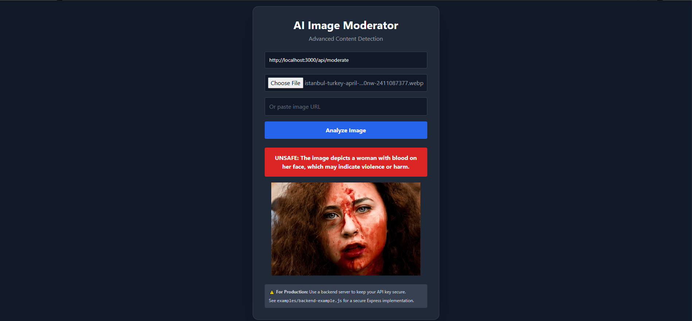

# How to Add Demo Screenshot

## Steps to Capture Demo Screenshot

1. **Start the Backend Server**
   ```bash
   node examples/backend-example.js
   ```

2. **Open in Browser**
   - Navigate to: `http://localhost:3000`

3. **Take a Screenshot**
   - On Windows: Press `Print Screen` or use `Windows + Shift + S`
   - On Mac: Press `Command + Shift + 4`
   - On Linux: Use your screenshot tool

4. **Add Sample Image for Demo**
   - Download a test image or use an existing image
   - Upload it in the demo interface
   - Click "Analyze Image"
   - Let it complete analysis

5. **Capture the Result**
   - Take a screenshot showing the result (SAFE/UNSAFE status)
   - Save it as: `examples/demo-screenshot.png`

6. **Update README** (Optional)
   - Add this to the README after the "Demo Screenshots" section:
   ```markdown
   ### Live Demo
   
   ```

## Visual Guide

The demo page shows:
- Title: "AI Image Moderator"
- Backend URL input field
- Image upload area
- URL input field
- Analyze button
- Result display (green for SAFE, red for UNSAFE)
- Image preview
- Loading spinner during processing

## Tips

- Use a SAFE image first to see the green result
- Make sure the backend is running before taking screenshots
- Screenshot should show the full interface for clarity
- PNG format is recommended (transparent background friendly)
